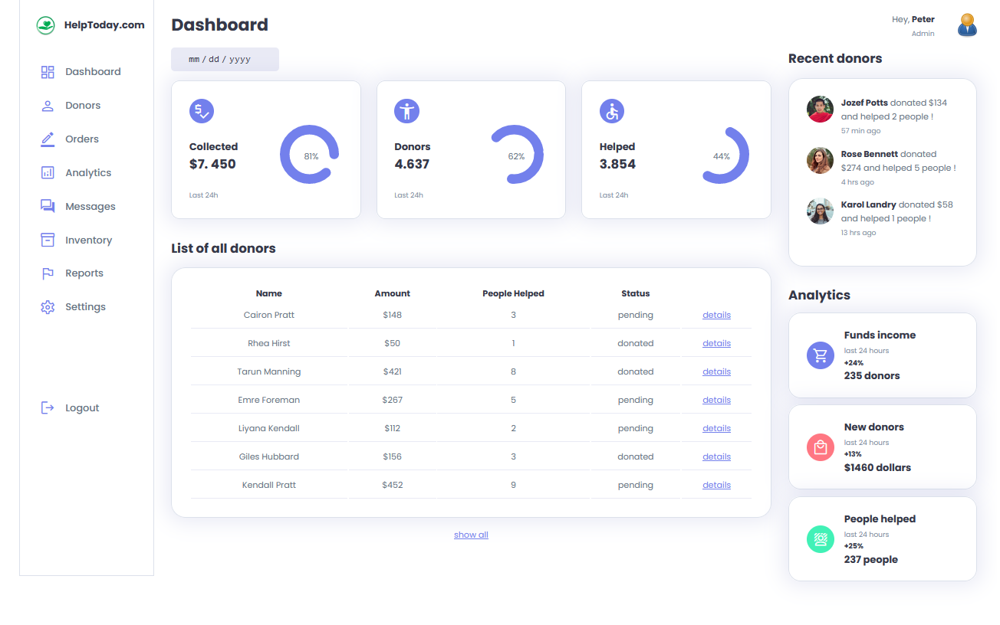

# 🛠 Sass - Admin panel

# 🔗 [Live Preview](https://courageous-dodol-82fe98.netlify.app/)

## Welcome! 👋

- This was a huge learning project in which I practiced how to use Sass features and how to better understand styling. I did not code this entirely by myself, rather it was a YouTube tutorial through which I was testing my skills. It is fully responsive with pop-up menu for mobile sizes

### Languages and features 👨‍💻 

- Sass: mixins, variables, responsive, nesting, partials.
- JS: on-click modifying style properties

Thanks for checking out my projects.